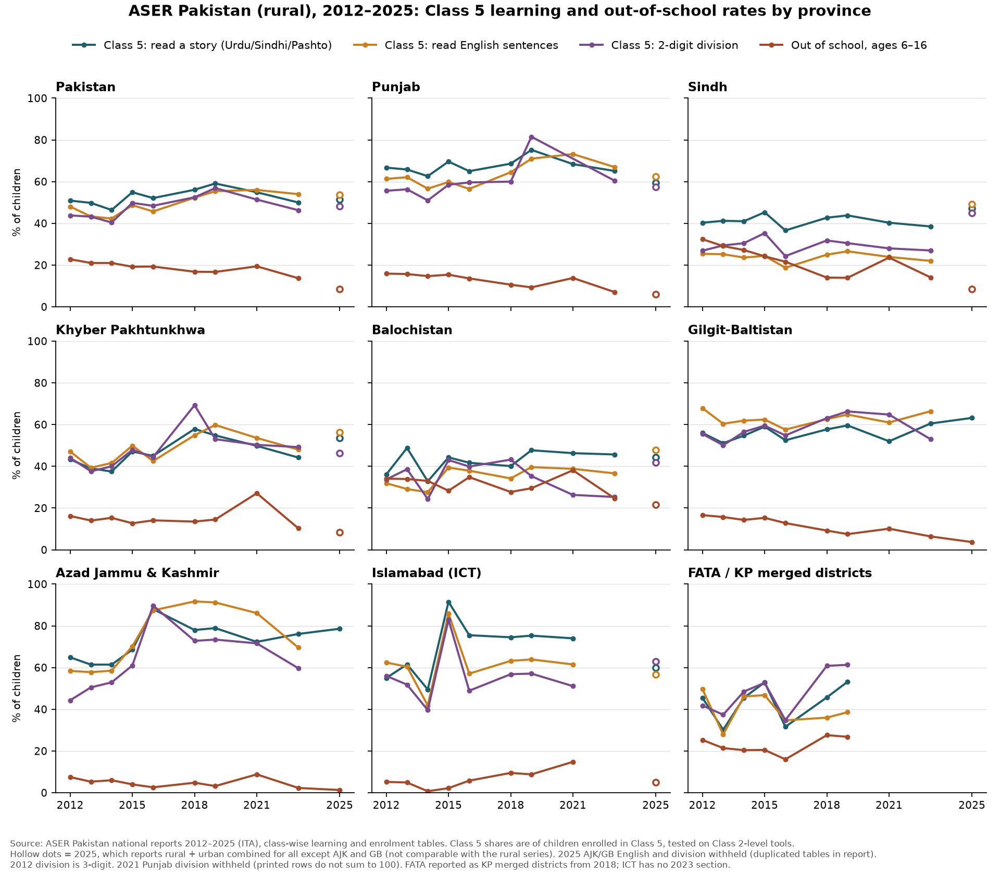

# ASER Pakistan Data Explorer

An independent, source-linked explorer for learning and enrolment data from **ASER Pakistan** (Annual Status of Education Report), the citizen-led household survey run by Idara-e-Taleem-o-Aagahi (ITA). ASER tests children aged 5–16 at home in reading (Urdu, Sindhi or Pashto, and English) and arithmetic, using Class 2 level tools.

**Live site:** https://lcrawfurd.github.io/aser-pakistan-explorer/

Every number traces to a specific page of a published ASER Pakistan national report. Nothing is interpolated, averaged or filled in. This is not an official ITA or ASER Pakistan product.

Inspired by [anustup-nayak/aser-data-explorer](https://github.com/anustup-nayak/aser-data-explorer), which does the same for ASER India.

## What's in it

| | |
|---|---|
| Survey rounds | 2012, 2013, 2014, 2015, 2016, 2018, 2019, 2021, 2023, 2025 |
| Geographies | Pakistan (national), Punjab, Sindh, Khyber Pakhtunkhwa, Balochistan, Gilgit-Baltistan, AJK, Islamabad (ICT), FATA / KP merged districts |
| Tables | Class-wise learning levels (Class 1–10) in Urdu/Sindhi/Pashto, English and arithmetic; enrolment by school type and out-of-school by age band (6–10, 11–13, 14–16, 6–16) |
| Rows | 15,725 values, each with PDF page and printed page |

## Files

- `index.html`: the explorer, a single self-contained page.
- `data/aser_pakistan_tables.csv`: every extracted value in long format: `year, geography, geo_level, table, language_label, class_or_age, level, value, pdf_page, printed_page, note, source_url`.
- `data/data.json`: the same data, reshaped for the explorer, with comparability flags.
- `data/notes/`: extraction notes for each year: pages used, label variants, validation results and problems found in the reports.
- `charts/`: the province trend chart and the script that draws it (`python charts/plot_trends.py`, needs matplotlib).

## How the data was extracted and checked

Values were read from the class-wise tables in each year's national (rural) report, using the PDF text layer. Where a page had no text layer (several 2025 pages), values were read by OCR and checked by eye against a rendered image, cell by cell. For every year:

- each class row of each learning table was checked to sum to 100 (±1.5);
- each enrolment age band was checked to sum to 100, and the printed Total row was checked against its components;
- whole tables were compared against rendered page images;
- the report's own headline sentences (for example "50% of class 5 children could read a story") were checked against the national rows.

## Comparability: read before comparing years

- **2025 combines rural and urban.** The 2025 report gives rural and urban children combined for Pakistan, Punjab, Sindh, KP, Balochistan and ICT. Only AJK and Gilgit-Baltistan are rural only. The explorer and chart show 2025 as a separate hollow point. A rural-only out-of-school figure is available from the 2025 area panel and is shown where printed.
- **2025 AJK and GB English and arithmetic tables are identical, cell for cell**, in the report. They are withheld.
- **Six 2021 rows don't sum to 100 as printed:** Punjab arithmetic Classes 2–5, Sindh arithmetic Class 4 and Balochistan English Class 9. Their cumulative ("at least") figures are withheld; the raw rows are kept in the CSV.
- **2012 division is 3-digit.** From 2013 the top arithmetic level is 2-digit division.
- **Arithmetic gains rungs:** a 100–200 rung from 2019 and 3-digit subtraction from 2021. "At least subtraction" counts every rung from 2-digit subtraction upward, so it stays comparable.
- **FATA** is reported as "KP newly merged districts" from 2018 and has no separate section after 2019. ICT has no section in 2023.
- **Small areas are noisy.** ICT, AJK, GB and FATA have small samples, and their year-to-year swings are large.
- Each round samples rural districts afresh, so trends compare cohorts, not the same children.

## Sources

| Round | National report |
|---|---|
| 2012 | https://aserpakistan.org/document/aser/2012/reports/national/National2012.pdf |
| 2013 | https://aserpakistan.org/document/aser/2013/reports/national/ASER_National_Report_2013.pdf |
| 2014 | https://aserpakistan.org/document/aser/2014/reports/national/ASER_National_Report_2014.pdf |
| 2015 | https://aserpakistan.org/document/aser/2015/reports/national/ASER_National_Report_2015.pdf |
| 2016 | https://aserpakistan.org/document/aser/2016/reports/national/Annual-Status-of-Education-Report-ASER-2016.pdf |
| 2018 | https://aserpakistan.org/document/aser/2018/reports/national/ASER_National_2018.pdf |
| 2019 | https://aserpakistan.org/document/aser/2019/reports/national/ASER_National_2019.pdf |
| 2021 | https://aserpakistan.org/document/aser/2021/reports/national/ASER_report_National_2021.pdf |
| 2023 | https://aserpakistan.org/document/2024/aser_national_2023.pdf |
| 2025 | https://aserpakistan.org/document/2025/aser_national_2025.pdf |

The reports are linked, not redistributed. ASER Pakistan's child-level raw data is available separately from [aserpakistan.org](https://aserpakistan.org/index.php?func=data_statistics) under ITA's own terms; it is not used here.

## Citing

Cite the original ASER Pakistan report and page shown with each figure, for example: *ASER Pakistan (2024). Annual Status of Education Report 2023, National (Rural). Lahore: Idara-e-Taleem-o-Aagahi, p. 59.* If you use this compilation, also cite this repository.

## Licence

Code (the explorer page and chart script) is released under the MIT licence. The data and reports are ITA / ASER Pakistan's. The MIT licence does not cover them, or the ASER name and marks.

Corrections welcome: open an issue with the year, geography, table and page.
